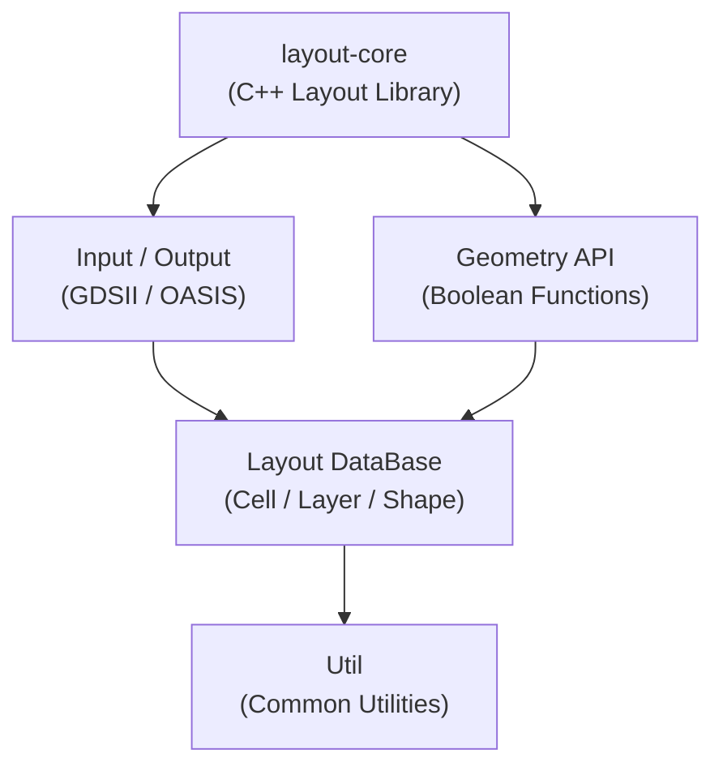

# layout-core

EDA版图数据处理的 C++ 库，提供 GDS2 / OASIS 读写以及图形的布尔运算。

## 模块架构

```mermaid
graph TD
    PROJECT["layout-core<br/>(C++ Layout Library)"]
    IO["Input / Output<br/>(GDSII / OASIS)"]
    GEO["Geometry API<br/>(Boolean Functions)"]
    DATA["Layout DataBase<br/>(Cell / Layer / Shape)"]
    UTIL["Util<br/>(Common Utilities)"]

    PROJECT-->IO
    PROJECT-->GEO
    IO-->DATA
    GEO-->DATA
    DATA-->UTIL

```

